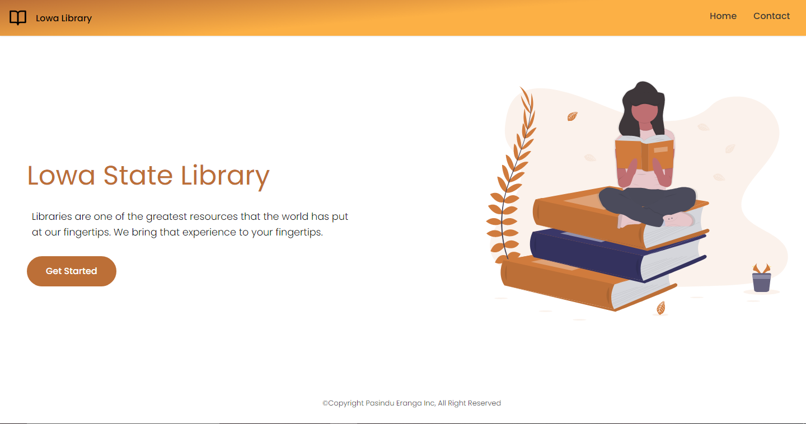
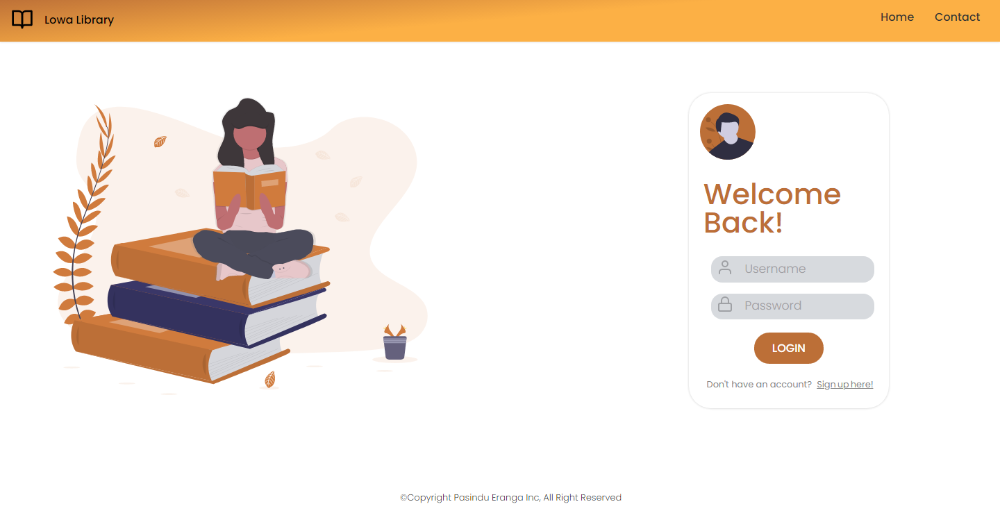
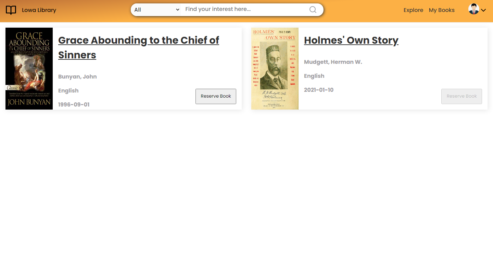

# Library Management System

Borrowing books, returning books or viewing the available books at the Library of the Lowa State University is currently done manually. 
Online Library Management System supports to overcome the above-mentioned problems. This system would be used by members who may be students or professors of that University to check the availability of the books and borrow the books., The librarian can update the member details and the book lending details.
Online Library Management System will include the following information. 
 
 
-	The librarian, students and the professors can register and login to the system
-	Any of the above users can update their profile details including the password
-	The authorized users can reserve a book for 24hours 
-	The authorized users can check book availability
-	The librarian can check the member status and update the lending details (If the book is for the lending) 
-	The system allows the Librarian to create the books catalog, add/delete books and maintain the books catalog.
-	The librarian can update the book return details
-	The librarian can calculate the fine for the late returns if necessary 
-	The users can search the books according to the categories (Novels, Frictions, etc.)

<b>Landing Interface</b>

<b>Login Page</b>

<b>Register Page</b>

<b>Home Page</b>

